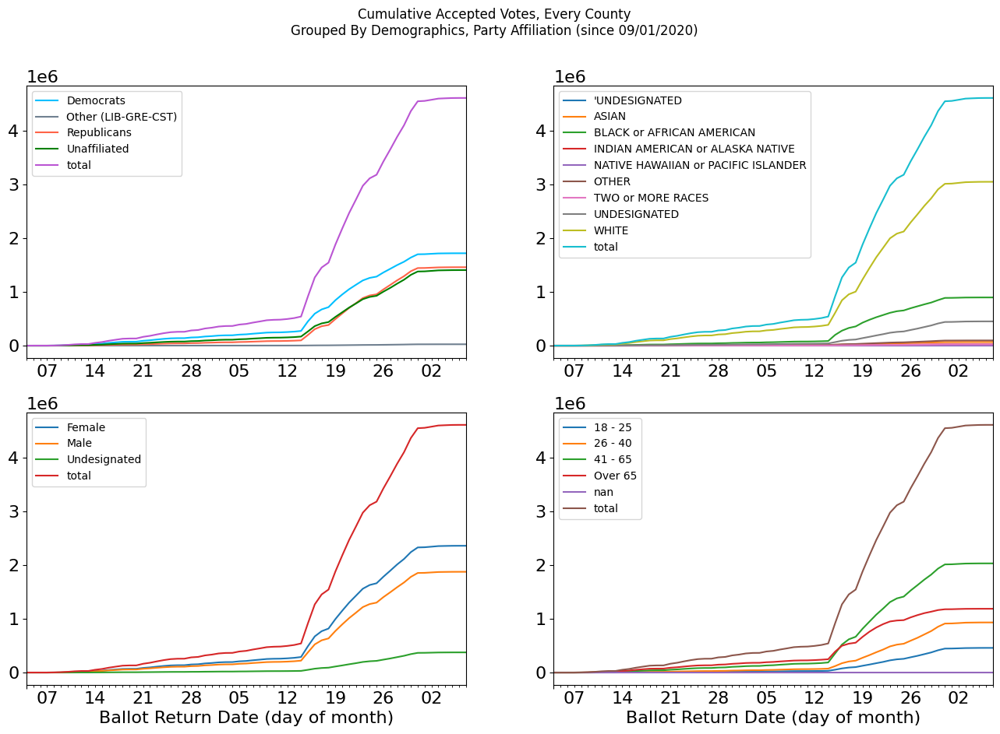
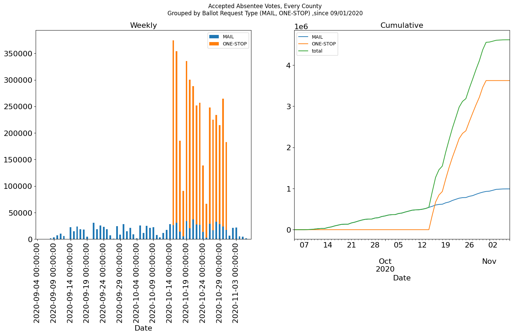
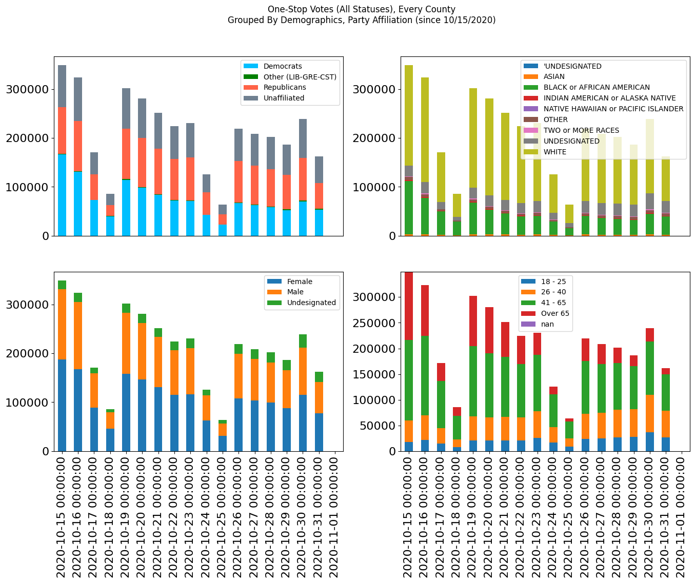
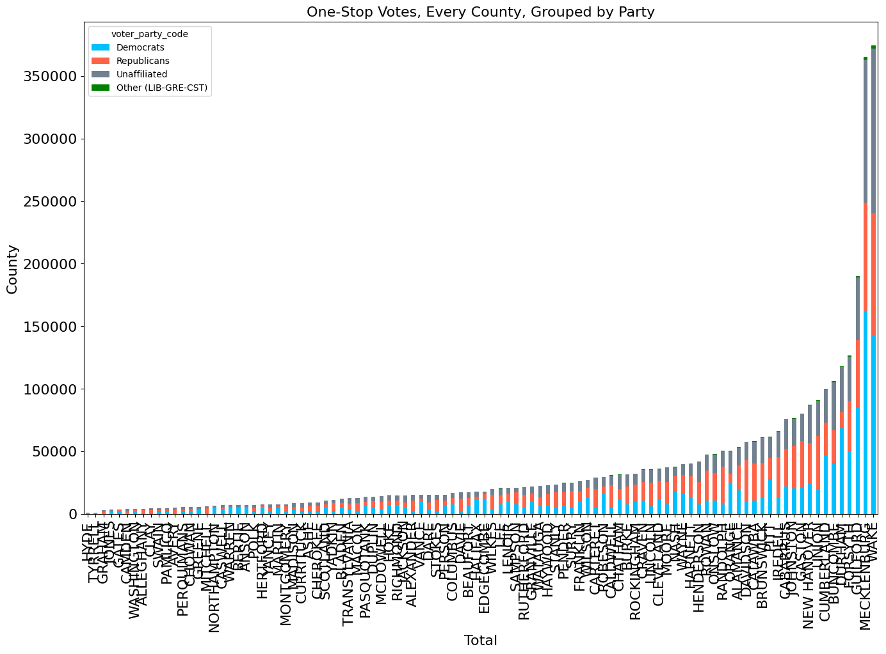
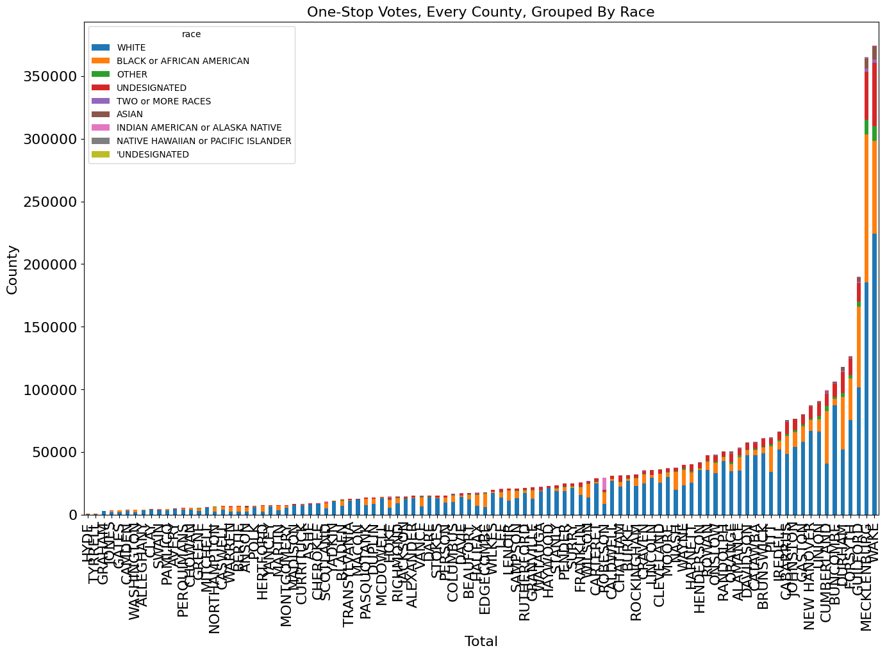
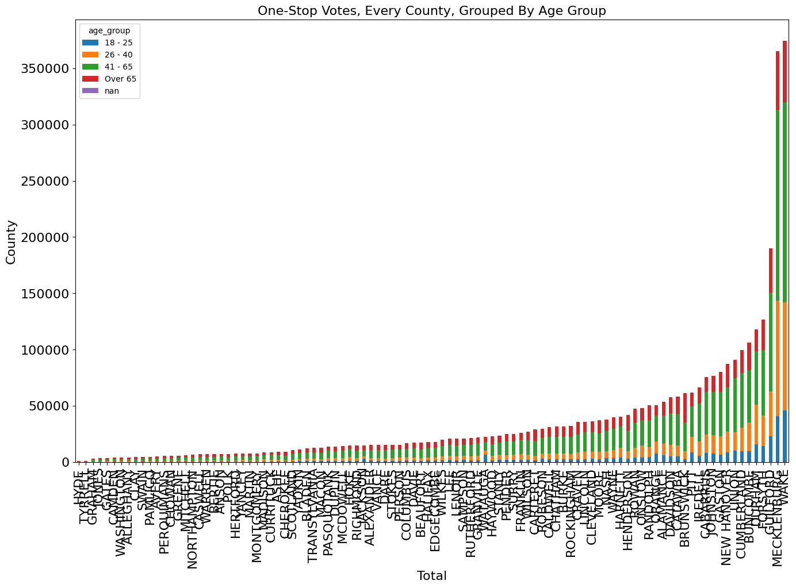

{:class="img-responsive"}

## [Summary](#summary)

Summary Table **OUT OF DATE**



- Registrations since 2020-02-28 (before COVID-19 shelter-in-place), absentee
  registrations since 2020-01-01.
- 'Other' = Registrations for Constitution, Green, Libertarian Parties

## [Registration](#registrations)

### [By Week](#registrations)

{:class="img-responsive"}

### [By County](#counties)

{:class="img-responsive"}
  
{:class="img-responsive"}

## Votes Cast

### By Demographic

{:class="img-responsive"}
  
{:class="img-responsive"}

### By County

{:class="img-responsive"}

### By Request Type (Mail, One-Stop)

{:class="img-responsive"}

### [Absentee/VBM Requests](#absentee)

### By Week

{:class="img-responsive"}
  
{:class="img-responsive"}

### By County

{:class="img-responsive"}

## [Absentee/VBM Submissions](#submissions)

VBM Submissions **OUT OF DATE**

### [By Week - Submitted](#submitted-by-week)

{:class="img-responsive"}
  
{:class="img-responsive"}

### [By Week - Returned For Correction / Not Accepted](#rejected-by-week)

{:class="img-responsive"}
  
{:class="img-responsive"}

### [By County](#submitted-by-county)

{:class="img-responsive"}
  
{:class="img-responsive"}

## One Stop Absentee Cast

### By Week

{:class="img-responsive"}

### By County

{:class="img-responsive"}
  
{:class="img-responsive"}
  
{:class="img-responsive"}

## Maps

### One-Stop Absentee Ballots Cast

  

    <iframe src="https://www.google.com/maps/d/embed?mid=1tP3laEdwClVXR8j8QFNwipqjyYa8elV8" width="640" height="480" frameborder="0" style="border:0;" allowfullscreen="" align="middle">
    </iframe>

  

### Non-Accepted/Rejected Absentee Ballots

  

    <iframe src="https://www.google.com/maps/d/embed?mid=1NHW6B1paxD1RAwbMWKakli-H-P9H5nto" width="640" height="480" frameborder="0" style="border:0;" allowfullscreen="" align="middle">
    </iframe>

  
